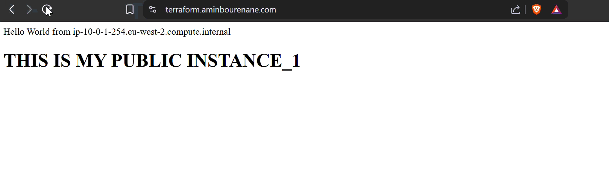

# Terraform-learning

1. VPC
2. two private subnets & two public subnets
3. Load balancer -> two public subnets
4. Using an ACM to allow HTTPS connection with Load balancer
5. Using my own sub-domain through Route53 (terraform.aminbourenane.com) 

